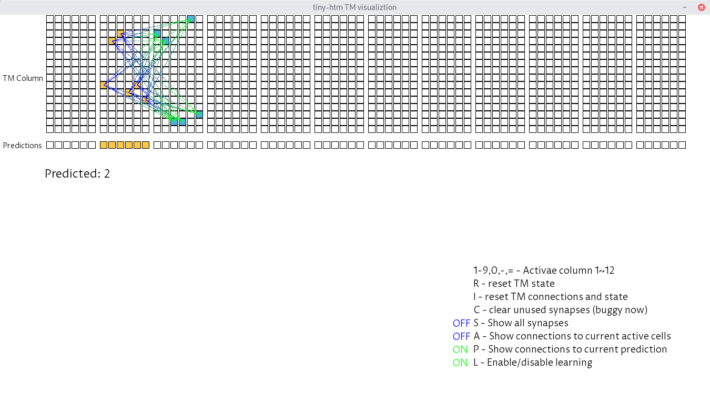

# tmviz
A simple HTM TemporalMemory visualizer in C++ 

## Dependencies
xtensor, SFML

### Linux
You can deal with it no problem fellow Linux user!

### OS X
```
homebrew install xtensor sfml
```

## Build
```
git clone --recursive https://github.com/marty1885/tmviz
cd tmviz
mkdir build 
cd build
cmake ..
make
```

## run and controlls
```
bin/tmviz
```

Controlls:
* 1-9,0,-,= - Activae column 1~12
* R - reset TM state
* I - reset TM connections and state
* C - clear unused synapses (buggy now)
* S - Show all synapses
* A - Show connections to current active cells
* P - Show connections to current prediction
* L - Enable/disable learning

Screenshot:



